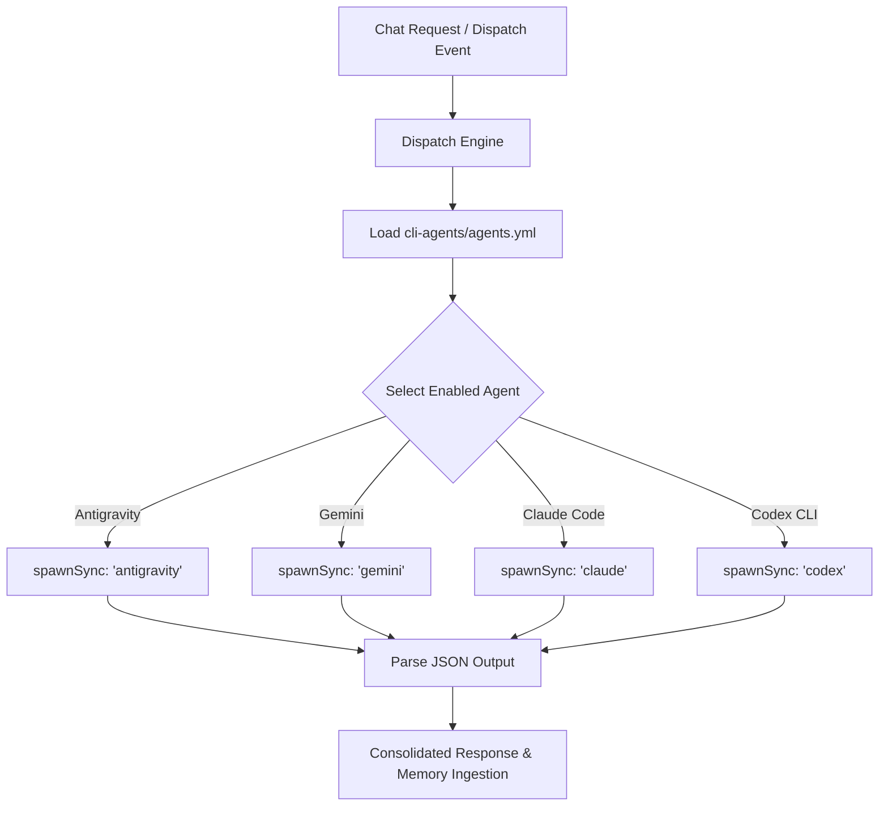

# CLI Agents — Headless Multi-Agent Orchestration & Dispatch Engine

This system skill governs the discovery, configuration, and execution of headless **CLI Agents** within the Total Recall Sovereign OS. It replaces local models (via Ollama/Gemma) with a high-speed, parallelized dispatch engine that orchestrates elite external developer agents (`antigravity`, `gemini`, `claude`, `codex`) via synchronous subprocess execution (`spawnSync`).

---

## 🎯 SYSTEM OVERVIEW

The CLI Agent Dispatch Engine parses agent profiles from the central registry file:
`.agent/skills/total-recall/skills/cli-agents/agents.yml`



### Core Execution Modality
To maintain deterministic control, security compliance, and bypass complex permission prompts, agents are headlessly spawned with custom default models, auto-accept parameters, and yolo bypass flags configured per-binary.

---

## 📂 REGISTRY CONFIGURATION (`agents.yml`)

The primary configuration format defines active binaries, default flags, priorities, and execution modes:

> [!CAUTION]
> **The `antigravity` name collision — verified 2026-08-01, cost real money.**
>
> Three things share this name. Only one is free:
>
> | Name | What it is | Auth |
> |---|---|---|
> | `agy` (`~/.local/bin/agy`) | **Google Antigravity CLI** — the real one | AI Ultra plan ✅ |
> | `/Applications/Antigravity.app` | Antigravity IDE | AI Ultra plan ✅ |
> | `antigravity` on PATH | `total-recall/bin/antigravity.mjs`, 131-line wrapper | `GOOGLE_API_KEY` — **metered** ❌ |
>
> The wrapper only does `POST generativelanguage.googleapis.com/v1beta/models/{model}:generateContent?key=${GOOGLE_API_KEY}` — no OAuth path, so it can only bill the metered Gemini API. A 10-way parallel job dispatched to it returned 429 `"You exceeded your current quota"` on every call; the identical job through `agy` had zero quota errors.
>
> **The budget rule targets the Gemini _API_, never the CLIs.** `GEMINI_API_KEY` / `GOOGLE_API_KEY` / `GOOGLE_GENERATIVE_AI_API_KEY` are exhausted and owed; `agy` on AI Ultra is unlimited. Never let "avoid Gemini" cause you to skip `agy`.
>
> Headless: `agy -p "prompt" --output-format json` → `{status:"SUCCESS", response:"...", usage:{...}}`.
> Docs: https://antigravity.google/docs/cli/headless
>
> **Probe once before any bulk fan-out.** A binary's name is not proof of plan coverage.

```yaml
agents:
  # Google Antigravity CLI — binary is `agy`, runs on AI Ultra.
  - name: agy
    binary: agy
    flags: --output-format json -p
    priority: 1
    enabled: true
    exec: flag
  # DISABLED — metered API wrapper, see the caution above.
  - name: antigravity
    binary: antigravity
    flags: --sandbox=false --yolo -o json
    priority: 6
    enabled: false
    exec: flag
  - name: gemini
    binary: gemini
    flags: --sandbox=false --yolo -o json
    priority: 2
    enabled: true
    exec: flag
  - name: claude
    binary: claude
    flags: --output-format json --permission-mode bypassPermissions --setting-sources local --tools "" -p
    priority: 3
    enabled: true
    exec: flag
  - name: codex
    binary: codex
    flags: -m gpt-5.5 --sandbox workspace-write --json --skip-git-repo-check
    priority: 4
    enabled: true
    exec: subcommand
timeout: 300
max_retries: 2
```

### Invocation contract per binary — verified 2026-08-01 by live probe

Each of these cost a failed run before it was pinned down.

| Binary | Rule |
|---|---|
| `agy` | `agy -p "prompt" --output-format json` → `{status:"SUCCESS", response:"…"}`. Works today. |
| `claude` | Non-interactive **requires `-p`/`--print`**; a bare positional prompt fails with `Input must be provided either through stdin or as a prompt argument`. `-p` must be the **last** flag — `--tools` is variadic (`<tools...>`) and swallows everything after it, including the prompt. Working end-to-end. |

### Host-session auth is NOT the CLI's auth

A spawned `claude` reporting `Not logged in · Please run /login` from *inside* a Claude Code session does **not** mean the session is unauthenticated. Two separate credential paths:

- A desktop-host session has its token injected at runtime (`CLAUDE_CODE_SDK_HAS_HOST_AUTH_REFRESH` / `CLAUDE_CODE_SDK_HAS_OAUTH_REFRESH` in env). The token lives in the host process — a child inherits the env vars but **not** the token.
- The standalone CLI reads the `Claude Code-credentials` keychain entry. **Entry existence proves nothing**: it can be present with `accessToken`/`refreshToken` empty and `expiresAt: 0`. Inspect the fields, not the entry.
- `ANTHROPIC_BASE_URL` is a red herring; unsetting it changes nothing.
- Only an interactive `claude` → `/login` populates it. An agent cannot do this — it is a credential flow. Ask the user.

### ⚠️ Which `agents.yml` is actually live

`getAgentsConfigPath()` in `total-recall/src/core/runtime.mjs` resolves against the **global `~/.agent` directory, not the repo you are editing**, and returns the first hit from:

1. `~/.agent/skills/total-recall/modules/agents/agents.yml`
2. `~/.agent/skills/total-recall/skills/cli-agents/agents.yml` ← currently live
3. `~/.agent/skills/cli-agents/agents.yml`

**Editing `total-recall/.agent/skills/.../agents.yml` in the repo changes nothing at runtime.** Confirm which file is in force before assuming a registry change took effect — print the resolved chain:

```bash
node --input-type=module -e "import {loadRuntimeConfig} from './src/core/runtime.mjs'; const c=loadRuntimeConfig(); console.log(c.agents.filter(a=>a.enabled).map(a=>a.name).join(' -> '))"
```

This was not academic: both live files had `antigravity` (the metered wrapper) enabled at **priority 1** long after the repo copy had been corrected.

### Dispatch bugs fixed in `runtime.mjs` (2026-08-01)

Three defects that silently corrupted results rather than erroring:

1. **Prompt was pushed before the flags.** That emitted a duplicate `-p` for agents whose flags already carry one, and defeated the ordering that stops claude's variadic `--tools` from eating the prompt. The prompt must go **last**.
2. **Flags were whitespace-split without stripping quotes.** `spawnSync` has no shell, so `--tools ""` passed a literal two-character string `""` instead of an empty one.
3. **`parseAgentOutput` ran `JSON.parse` on the whole stdout.** That always throws for codex `--json` (a JSONL stream), and the raw stream was then returned as the model's answer.
4. **The fallback filter excluded only the most recent failure**, so a three-agent chain could hand work back to an already-failed agent while a healthy one further down went untried. Failures now accumulate in a `failedAgents` set; the cap is `agents.length + maxRetries`; exhaustion throws `All CLI agents failed (tried: …)`.

> [!IMPORTANT]
> **`callLocalRuntime(prompt, system, config)` takes THREE arguments.** Calling it as `(prompt, config)` puts the config in the `system` slot, leaves `config` undefined, and silently falls back to `DEFAULT_AGENTS` — the run succeeds while testing nothing you intended. When writing a verification harness, confirm a negative control actually fails before trusting any positive result.

### Agent availability is per-user, not per-binary

Do not enable an agent because its binary resolves on PATH. For this user: **no Gemini CLI** (`gemini` stays `enabled: false` — the Google surface they have is `agy`), and **no grok** (a stale binary may still sit at `~/.grok/bin/grok`). Verified working chain as of 2026-08-01: `agy` → `claude` → `codex`, each confirmed by a real end-to-end dispatch rather than a `--help` check.
| `codex` | `--full-auto` is **hidden from `codex exec --help` but still functions** as a deprecated alias (docs + live probe; `codex --full-auto` at the top level *is* rejected). Prefer `--sandbox workspace-write`. Pin the model with `-m`: a `model` in `~/.codex/config.toml` that the account can't use fails with HTTP 400 `not supported when using Codex with a ChatGPT account`. Account-supported slugs live in `~/.codex/models_cache.json`. |

### ⚠️ Exit code 0 does NOT mean the run succeeded

Both `claude` and `codex` exit **0** on a failed run and report the failure only inside the payload. A dispatcher that gates on `status === 0` will accept an error message as the model's answer.

| Binary | Failure shape at exit 0 |
|---|---|
| `claude` | `{"subtype":"success","is_error":true,"result":"Not logged in · Please run /login"}` |
| `codex` | `{"type":"turn.failed","error":{"message":"…"}}` |
| `agy` | `status` field != `"SUCCESS"` |

Always inspect the payload before trusting the result, and treat a soft error as a reason to **fall back immediately** rather than retry — auth and model-config failures are not transient.

### ⚠️ `codex --json` is a JSONL event stream, not one object

The first balanced `{…}` in a codex response is `{"type":"thread.started",…}` — a control frame. A naive "first JSON object wins" parser returns that instead of the answer. The payload is the `item.text` of the `item.completed` frame whose `item.type` is `agent_message`. Control frames to skip: `thread.started`, `turn.started`, `turn.completed`, `turn.failed`, `item.started`, `item.updated`, `item.completed`, `error`.

### Key Execution Modes (`exec`)
*   **`flag`**: Appends input strings or JSON schemas as standard execution flags directly to the command invocation.
*   **`subcommand`**: Passes execution commands as a nested subcommand (e.g., `codex run --payload=...`).

---

## 🛡️ SECURITY & COMPLIANCE

1.  **Strict Sandbox Isolation**: When running third-party code generated during multi-agent dispatches, dispatches MUST enforce `--sandbox=true` unless explicitly overridden by `security.yml` locality rules.
2.  **State Verification**: The dispatch engine captures and parses `stderr` streams separately. Any unhandled exit code > 0 automatically raises a fallback sequence to the next enabled agent in the priority queue.
3.  **Authentication Handshake**: All spawned dispatches carry the active brain PAT token securely mapped via the `TR_PAT` environment variable to ensure seamless VFS memory access during execution.

---

## ⚠️ HARD-EARNED LESSONS & RECOVERY MANUAL (CRITICAL RUNTIME KNOWLEDGE)

The following architectural realities represent hard-earned technical breakthroughs required to ensure 100% stable execution of the `antigravity` agent and associated background dispatch loops. **DO NOT DEVIATE from these patterns during future updates or refactoring sessions.**

### 1. macOS LaunchAgent & Background Process PATH Isolation Pathology
*   **The Problem**: Background execution managers (like macOS LaunchAgents, cron jobs, and daemon processes) boot with a highly restricted, shell-isolated environment. This results in an empty or deeply stripped `$PATH` variable.
*   **The Pathology**: Spawning standard child processes (such as `spawnSync('which antigravity')`) under these contexts fails silently or throws empty strings, making active agents completely undiscoverable even if they are globally linked or installed.
*   **The Immutable Resolution**:
    1.  **Boot PATH Expansion**: Maintain proactive PATH expansion in the owning Total Recall package's `src/core/config.mjs` to expand `$PATH` using verified node versions and standard locations before any other logic compiles.
    2.  **Pure JS Resolver (`findBinaryInPath`)**: Never spawn external process calls (like `which`) for discovery. Instead, use the package's native Node.js filesystem resolver in `src/core/runtime.mjs`, which checks stat entries (`fs.statSync`) and file execution modes directly against path segments.

### 2. Gemini API Active Model Realities (2026)
*   **The Problem**: Many standard or legacy model mappings are deprecated, causing silent failures or standard `404` errors directly from the Google API endpoints.
*   **The Pathology**:
    -   `gemini-2.0-flash` is deprecated on modern API profiles and returns a `404` error for standard generation calls.
    -   `gemini-3.1-flash-live-preview` exists in the model registry but is restricted to audio/bidi streaming (`bidiGenerateContent`) and throws error codes for standard text generation.
*   **The Immutable Resolution**:
    1.  **Frontier Default**: Always default standard text dispatches directly to **`gemini-3.5-flash`** (verified active).
    2.  **Alias Mapping**: Maintain the robust alias mapping inside the CLI agent wrapper to dynamically map generic aliases to verified, functional frontier models:
        -   `gemini`, `default`, `flash`, `gemini-flash`, `3.5-flash` $\to$ **`gemini-3.5-flash`**
        -   `pro`, `gemini-pro`, `3.1-pro` $\to$ **`gemini-3.1-pro-preview`**

### 3. Standalone CLI Ingestion & Budget Safety compliance
*   **The Problem**: Standalone executions of custom CLI wrappers (like `antigravity`) run outside the main Express route controllers, making their token spend completely invisible to local tracking tools.
*   **The Pathology**: The Total Recall package's budget safety system (`src/core/usage-tracker.mjs`) scans `~/.gemini/tmp/<folder>/chats/*.jsonl` to calculate daily/weekly spending. If an agent does not log its token metadata upon execution, the budget watchdog remains blind to its consumption, leaving the user vulnerable to rate limit bans or massive billing spikes.
*   **The Immutable Resolution**:
    -   The `antigravity` wrapper *must* capture `usageMetadata` (`promptTokenCount` and `candidatesTokenCount`) from successful API responses and append it directly as a standard JSONL line to:
        `~/.gemini/tmp/antigravity/chats/usage.jsonl`
    -   This guarantees perfect compliance and zero-leak tracking under both manual shell executions and high-throughput background daemon runs.

### 4. System-Wide CLI Agent Ingestion & Inherent Tracking Mechanics
To maintain accurate monitoring and ensure budget safeties remain 100% synchronized across all reasoning tasks, the central `usage-tracker` scans and parses execution metrics dynamically per agent:
*   **`claude` (Claude Code)**: Automatically writes local logs to `~/.claude/stats-cache.json`. Total Recall parses this file on demand to sum token usages and calculate current expenditure.
*   **`codex` (OpenAI Codex CLI)**: Appends JSONL logs recursively under `~/.codex/sessions/`. Total Recall traverses this folder structure and aggregates `prompt_tokens` and `completion_tokens` directly.
*   **`gemini` (Standard Gemini CLI)**: Saves chat history files ending with `.jsonl` directly to `~/.gemini/tmp/<hash>/chats/`. Total Recall reads the `tokens.input` and `tokens.output` fields for each log turn.
*   **`antigravity` (Native Agent Wrapper)**: Replicates standard Gemini CLI structure by appending token entries directly to `~/.gemini/tmp/antigravity/chats/usage.jsonl` on every single query turn, ensuring full compliance with the central tracking core.
