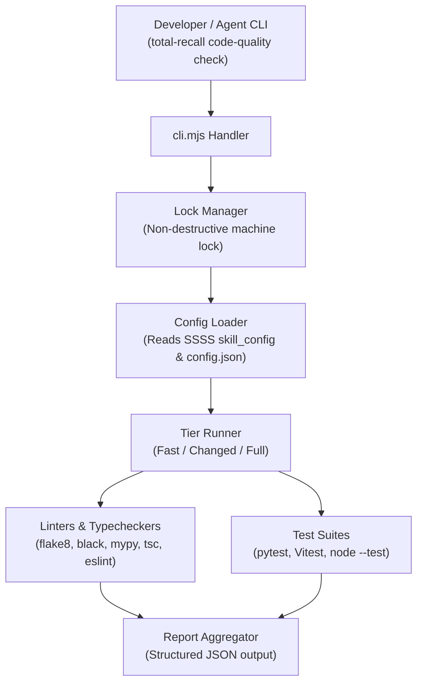

# CODE_QUALITY_PLUGIN — Architecture

> **Project Prefix**: `CODE_QUALITY_PLUGIN`  
> **Kanban State**: ✅ Completed  
> **Author**: Greg Iteen / Antigravity  
> **Date**: 2026-09-28  

---

## 1. Architecture Topology

## 2. Components

- `cli.mjs`: CLI routing for `check`, `report`, `validate`, `gate list`.
- `core/config.schema.json`: JSON Schema defining valid gate tiers, tool paths, and scopes.
- `commands/`: Integration commands for Total Recall.
